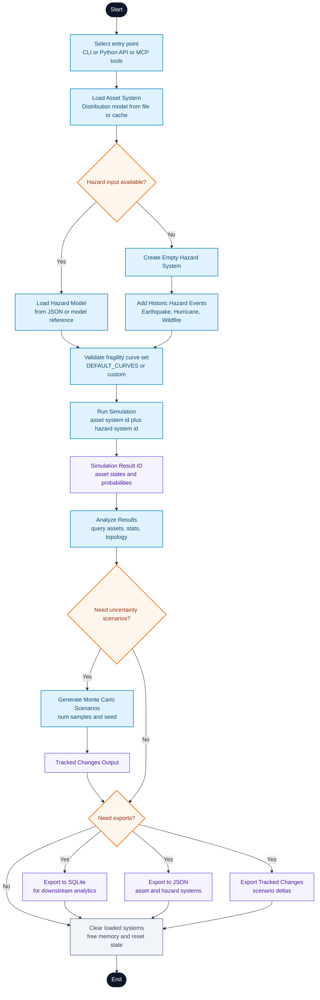

 •  •  •  •  •  •  •  •  •  • 

 

# ERAD (<u>E</u>nergy <u>R</u>esilience <u>A</u>nalysis for electric <u>D</u>istribution systems)

[Visit full documentation here.](https://nlr-distribution-suite.github.io/erad/)

Understanding the impact of disaster events on people's ability to access critical services is key to designing appropriate programs to minimize the overall impact. Flooded roads, downed power lines, flooded power substation etc. could impact access to critical services like electricity, food, health and more. The field of disaster modeling is still evolving and so is our understanding of how these events would impact our critical infrastructures such power grid, hospitals, groceries, banks etc.

ERAD is a free, open-source Python toolkit for computing energy resilience measures in the face of hazards like earthquakes and flooding. It uses graph database to store data and perform computation at the household level for a variety of critical services that are connected by power distribution network. It uses asset fragility curves, which are functions that relate hazard severity to survival probability for power system assets including cables, transformers, substations, roof-mounted solar panels, etc. recommended in top literature. Programs like undergrounding, microgrid, and electricity backup units for critical infrastructures may all be evaluated using metrics and compared across different neighborhoods to assess their effects on energy resilience.

ERAD is designed to be used by researchers, students, community stakeholders, distribution utilities to understand and possibly evaluate effectiveness of different post disaster programs to improve energy resilience. It was funded by National Renewable Energy Laboratory (NREL) and made publicly available with open license.

